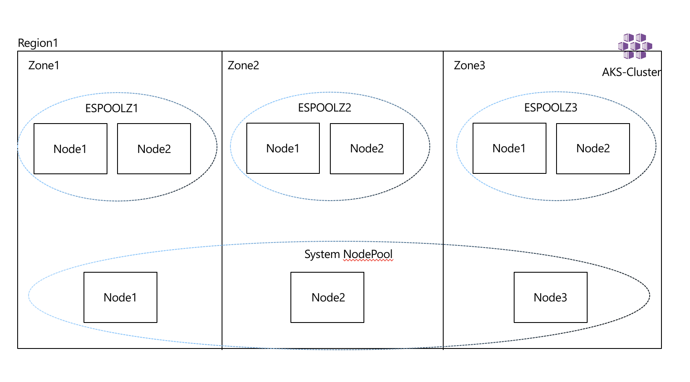

# Deploy a Stateful Elastic Search Workload on Kubernetes

This repository contains a playground for working with Elastic Search.

## Azure Kubernetes

### Kubernetes Design

- Enabled uptime SLA
- System Node Pool (no state)
- User Node Pool (state)
- Tainted User Node Pools
- Auto-scaling
- CNI Networking
- Ephemeral Disks for Node OS
- Managed Identities
- Cluster Monitoring




### Installation

#### AKS

Using [AKS Construction](https://github.com/Azure/Aks-Construction), we can quickly set up an AKS cluster to the correct configuration. It has been referenced as a git submodule, and therefore easily consumed in [this projects bicep infrastructure file](main.bicep).

The main.bicep deployment creates
- 1 AKS Cluster, with CSI Secrets Managed Identity
- 5 Azure Key Vaults
- 3 User Assigned Managed Identities
- The Azure Workload Identity Mutating Admission Webhook on the AKS cluster

### Guide

#### 1. clone the repo

```
git clone https://github.com/danielscholl/aks-elastic.git
cd aks-elastic
```

#### 2. Deploy the infrastructure to your azure subscription

```bash
RESOURCE_GROUP='elastic-playground'
AZURE_LOCATION='eastus'

# Look for and ensure VM Support for the desired VM Size in the Region.
az vm list-skus --location $AZURE_LOCATION --size Standard_D --all --output table |grep none

az group create --name $RESOURCE_GROUP --location $AZURE_LOCATION
DEPLOYMENT=$(az deployment group create -g $RESOURCE_GROUP -f main.bicep -o json)
CLUSTER_NAME=$(echo $DEPLOYMENT | jq -r '.properties.outputs.aksClusterName.value')
az aks get-credentials -n $CLUSTER_NAME -g $RESOURCE_GROUP --overwrite-existing


# Validate Nodes availability over Zones
kubectl get nodes
kubectl describe nodes -l agentpool=npsystem | grep -i topology.kubernetes.io/zone
kubectl get nodes -l purpose=elastic
kubectl describe nodes -l purpose=elastic | grep -i topology.kubernetes.io/zone
kubectl describe nodes -l purpose=elastic | grep -i agentpool
```


### Kubernetes Cluster Deployment

> Note: Bicep Conversion is not yet complete. Use CLI Process.

Look for and ensure VM Support for the desired VM Size in the Region.

```
az vm list-skus --location westeurope --size Standard_D --all --output table
```

```shell
LOCATION=westeurope
AKS_NAME=aks-elastic
RG=$AKS_NAME-$LOCATION
AKS_VNET_NAME=$AKS_NAME-vnet
AKS_CLUSTER_NAME=$AKS_NAME-cluster
AKS_VNET_CIDR=172.16.0.0/16
AKS_NODES_SUBNET_NAME=$AKS_NAME-subnet
AKS_NODES_SUBNET_PREFIX=172.16.0.0/23
SERVICE_CIDR=10.0.0.0/16
DNS_IP=10.0.0.10
NETWORK_PLUGIN=azure
NETWORK_POLICY=calico
SYSTEM_NODE_COUNT=3
USER_NODE_COUNT=2
NODES_SKU=Standard_D8ds_v4
K8S_VERSION=$(az aks get-versions  -l $LOCATION --query 'orchestrators[-2].orchestratorVersion' -o tsv)
SYSTEM_POOL_NAME=systempool
STORAGE_POOL_ZONE1_NAME=espoolz1
STORAGE_POOL_ZONE2_NAME=espoolz2
STORAGE_POOL_ZONE3_NAME=espoolz3
IDENTITY_NAME=$AKS_NAME`date +"%d%m%y"`

# Create Resource Group
az group create --name $RG --location $LOCATION
RG_ID=$(az group show -n $RG  --query id -o tsv)

# Create User Managed Identity
az identity create --name $IDENTITY_NAME --resource-group $RG
IDENTITY_ID=$(az identity show --name $IDENTITY_NAME --resource-group $RG --query id -o tsv)
IDENTITY_CLIENT_ID=$(az identity show --name $IDENTITY_NAME --resource-group $RG --query clientId -o tsv)

# Create Network
az network vnet create \
  --name $AKS_VNET_NAME \
  --resource-group $RG \
  --location $LOCATION \
  --address-prefix $AKS_VNET_CIDR \
  --subnet-name $AKS_NODES_SUBNET_NAME \
  --subnet-prefix $AKS_NODES_SUBNET_PREFIX
VNETID=$(az network vnet show -g $RG --name $AKS_VNET_NAME --query id -o tsv)
AKS_VNET_SUBNET_ID=$(az network vnet subnet show --name $AKS_NODES_SUBNET_NAME -g $RG --vnet-name $AKS_VNET_NAME --query "id" -o tsv)


# Allow Managed Identity access to Resource Group and VNet
az role assignment create --assignee $IDENTITY_CLIENT_ID --scope $RG_ID --role Contributor
az role assignment create --assignee $IDENTITY_CLIENT_ID --scope $VNETID --role Contributor

# Validate Role Assignment
az role assignment list --assignee $IDENTITY_CLIENT_ID --all -o table

# Create AKS Cluster
az aks create \
  -g $RG \
  -n $AKS_CLUSTER_NAME \
  -l $LOCATION \
  --node-count $SYSTEM_NODE_COUNT \
  --node-vm-size $NODES_SKU \
  --network-plugin $NETWORK_PLUGIN \
  --network-policy $NETWORK_POLICY \
  --kubernetes-version $K8S_VERSION \
  --generate-ssh-keys \
  --service-cidr $SERVICE_CIDR \
  --dns-service-ip $DNS_IP \
  --vnet-subnet-id $AKS_VNET_SUBNET_ID \
  --enable-addons monitoring \
  --enable-managed-identity \
  --assign-identity $IDENTITY_ID \
  --nodepool-name $SYSTEM_POOL_NAME \
  --uptime-sla \
  --zones 1 2 3 \
  --node-osdisk-type Ephemeral \
  --node-osdisk-size 128


# Configure kubenet Access
az aks get-credentials -n $AKS_CLUSTER_NAME -g $RG

# Validate Nodes availability over Zones
kubectl get nodes
kubectl describe nodes -l agentpool=systempool | grep -i topology.kubernetes.io/zone

# Add Nodes Pool For Zone 1
az aks nodepool add \
  --cluster-name $AKS_CLUSTER_NAME \
  --mode User \
  --name $STORAGE_POOL_ZONE1_NAME \
  --node-vm-size $NODES_SKU \
  --resource-group $RG \
  --zones 1 \
  --enable-cluster-autoscaler \
  --max-count 4 \
  --min-count 2 \
  --node-count $USER_NODE_COUNT \
  --node-taints app=elasticsearch:NoSchedule \
  --labels dept=dev purpose=storage \
  --tags dept=dev costcenter=1000 \
  --node-osdisk-type Ephemeral \
  --node-osdisk-size 128 \
  --no-wait

# Add Nodes Pool For Zone 2
az aks nodepool add \
  --cluster-name $AKS_CLUSTER_NAME \
  --mode User \
  --name $STORAGE_POOL_ZONE2_NAME \
  --node-vm-size $NODES_SKU \
  --resource-group $RG \
  --zones 2 \
  --enable-cluster-autoscaler \
  --max-count 4 \
  --min-count 2 \
  --node-count $USER_NODE_COUNT \
  --node-taints app=elasticsearch:NoSchedule \
  --labels dept=dev purpose=storage \
  --tags dept=dev costcenter=1000 \
  --node-osdisk-type Ephemeral \
  --node-osdisk-size 128 \
  --no-wait


# Add Nodes Pool For Zone 3
az aks nodepool add \
  --cluster-name $AKS_CLUSTER_NAME \
  --mode User \
  --name $STORAGE_POOL_ZONE3_NAME \
  --node-vm-size $NODES_SKU \
  --resource-group $RG \
  --zones 3 \
  --enable-cluster-autoscaler \
  --max-count 4 \
  --min-count 2 \
  --node-count $USER_NODE_COUNT \
  --node-taints app=elasticsearch:NoSchedule \
  --labels dept=dev purpose=storage \
  --tags dept=dev costcenter=1000 \
  --node-osdisk-type Ephemeral \
  --node-osdisk-size 128 \
  --no-wait

# After a few minnutes Validate Nodes availability over Zones
kubectl get nodes -l dept=dev
kubectl describe nodes -l dept=dev | grep -i topology.kubernetes.io/zone
kubectl describe nodes -l dept=dev | grep -i agentpool
```


## Elastice Search

### Elastic Search Design

ElasticSearch has 3 main components that make up the cluster Client/Coordinating, Masters, and Data Nodes. you can read more about what each one does in elastic [public docs](https://www.elastic.co/guide/index.html).

1. **Client/Coordinating Nodes** Act as a reverse proxy for the clusters, this is what the external world interacts with. its deployed as a k8s deployment with horizontal pod autoscaling enabled, we will try to have a client in each node to minimize data movement across nodes, we can minimize but we can't prevent it from happening.

2. **Master Nodes** stores the metadata about the data nodes, it will be deployment as a k8s deployment, ideally we need 3.

3. **Data Nodes** this is where the magic is, this is where the indices are stored and replicated. this would be our Statefulset with persistent volume to persist the data.

Here is how the cluster will look like


### Elastic Search Cluster Installation

### Prepare The Cluster

__Create the storage class__

```bash
kubectl apply -f es_storageclass.yaml
```

__Create a Chart Values File__

```bash
helm repo add bitnami https://charts.bitnami.com/bitnami
helm show values bitnami/elasticsearch > values.yaml
```

__Customize the values__

Ensure the storageClassName is set to the name of the storage class created above.

```yaml
#### Global Values Changes
global:
  storageClass: es-storageclass

#### Master Values Changes
master:
  name: master
  replicas: 3
##
  affinity:
    nodeAffinity:
      requiredDuringSchedulingIgnoredDuringExecution:
        nodeSelectorTerms:
        - matchExpressions:
          - key: topology.kubernetes.io/zone
            operator: In
            values:
            - westeurope-1    # THIS DEPENDS ON LOCATION
            - westeurope-2    # THIS DEPENDS ON LOCATION
            - westeurope-3    # THIS DEPENDS ON LOCATION
      requiredDuringSchedulingIgnoredDuringExecution:
        nodeSelectorTerms:
        - matchExpressions:
          - key: agentpool
            operator: In
            values:
            - espoolz1
            - espoolz2
            - espoolz3
##
  tolerations:
    - key: "app"
      operator: "Equal"
      value: "elasticsearch"
      effect: "NoSchedule"
##
  autoscaling:
    enabled: false
    minReplicas: 3
    maxReplicas: 5

#### Coordinating Value Changes
coordinating:
  replicas: 6
##
  affinity:
    nodeAffinity:
      requiredDuringSchedulingIgnoredDuringExecution:
        nodeSelectorTerms:
        - matchExpressions:
          - key: topology.kubernetes.io/zone
            operator: In
            values:
            - westeurope-1   # THIS DEPENDS ON LOCATION
            - westeurope-2   # THIS DEPENDS ON LOCATION
            - westeurope-3   # THIS DEPENDS ON LOCATION
      requiredDuringSchedulingIgnoredDuringExecution:
        nodeSelectorTerms:
        - matchExpressions:
          - key: agentpool
            operator: In
            values:
            - espoolz1
            - espoolz2
            - espoolz3
##
  tolerations:
    - key: "app"
      operator: "Equal"
      value: "elasticsearch"
      effect: "NoSchedule"
##
  service:
    type: LoadBalancer
    port: 9200
##
  autoscaling:
    enabled: false
    minReplicas: 6
    maxReplicas: 12

### Data Value Changes
data:
  name: data
  replicas: 6
##
  affinity:
    nodeAffinity:
      requiredDuringSchedulingIgnoredDuringExecution:
        nodeSelectorTerms:
        - matchExpressions:
          - key: topology.kubernetes.io/zone
            operator: In
            values:
            - westeurope-1   # THIS DEPENDS ON LOCATION
            - westeurope-2   # THIS DEPENDS ON LOCATION
            - westeurope-3   # THIS DEPENDS ON LOCATION
      requiredDuringSchedulingIgnoredDuringExecution:
        nodeSelectorTerms:
        - matchExpressions:
          - key: agentpool
            operator: In
            values:
            - espoolz1
            - espoolz2
            - espoolz3
##
  tolerations:
    - key: "app"
      operator: "Equal"
      value: "elasticsearch"
      effect: "NoSchedule"
##
 autoscaling:
    enabled: false
    minReplicas: 6
    maxReplicas: 18
```


### ElasticSearch Cluster Deployment

Now that we have configured the charts, we are ready to deploy the ES cluster

1. Deploy the chart

```shell
# Create Namespace
kubectl create namespace elasticsearch
helm install elasticsearch-v1 bitnami/elasticsearch -n elasticsearch --values values.yaml

# Watch the Pods start
kubectl get pods -n elasticsearch

# Validate the Pod Distribution
kubectl get pods -n elasticsearch -o wide

# Check Functionality
kubectl get svc elasticsearch-v1-coordinating-only -n elasticsearch

esip=`kubectl get svc elasticsearch-v1-coordinating-only -n elasticsearch -o=jsonpath='{.status.loadBalancer.ingress[0].ip}'`
curl "http://$esip:9200/_cluster/health?pretty"

# Create an index called test with 3 shards and one replica
curl -XPUT "http://$esip:9200/test?pretty" -H 'Content-Type: application/json' -d'{"settings" : {"index" : {"number_of_shards" : 3, "number_of_replicas" : 1 }}}'

# Validate the distribution of the shards
curl http://$esip:9200/_cat/shards/test\?pretty\=true

# Compare to pods
kubectl get pods -o wide -n elasticsearch -l app=data
```


Please continue to next section [Handling Failures](handling_failures.md)
