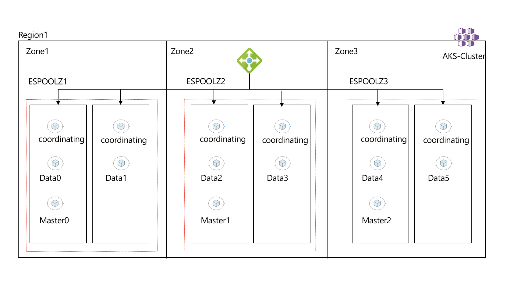

# Deploy a Stateful Elastic Search Workload on Kubernetes

This repository contains a playground for working with Elastic Search.

[](https://portal.azure.com/#create/Microsoft.Template/uri/https%3A%2F%2Fraw.githubusercontent.com%2Fdanielscholl%2Faks-elastic%2Fmain%2Fazuredeploy.json)


## Azure Kubernetes

### Kubernetes Design

- Enabled uptime SLA
- System Node Pool (no state)
- User Node Pool (state)
- Tainted User Node Pools
- Auto-scaling
- CNI Networking
- Ephemeral Disks for Node OS
- Managed Identities
- Cluster Monitoring


### Installation

#### AKS

Using [AKS Construction](https://github.com/Azure/Aks-Construction), we can quickly set up an AKS cluster to the correct configuration. It has been referenced as a git submodule, and therefore easily consumed in [this projects bicep infrastructure file](main.bicep).

The main.bicep deployment creates
- 1 AKS Cluster, with Monitoring, Policy and Flux enabled.

### Guide

#### 1. clone the repo

```
git clone https://github.com/danielscholl/aks-elastic.git
cd aks-elastic
```

#### 2. Deploy the infrastructure to your azure subscription

> _Optional_ - Look for and ensure VM Support for the desired VM Size in the Region.
  `az vm list-skus --location $AZURE_LOCATION --size Standard_D --all --output table |grep none`


```bash
RESOURCE_GROUP='elastic-playground'
AZURE_LOCATION='eastus'

az group create --name $RESOURCE_GROUP --location $AZURE_LOCATION
DEPLOYMENT=$(az deployment group create -g $RESOURCE_GROUP -f main.bicep -o json)
CLUSTER_NAME=$(echo $DEPLOYMENT | jq -r '.properties.outputs.aksClusterName.value')
az aks get-credentials -n $CLUSTER_NAME -g $RESOURCE_GROUP --overwrite-existing


# Validate Nodes availability over Zones
kubectl get nodes
kubectl describe nodes -l agentpool=npsystem | grep -i topology.kubernetes.io/zone
kubectl get nodes -l purpose=elastic
kubectl describe nodes -l purpose=elastic | grep -i topology.kubernetes.io/zone
kubectl describe nodes -l purpose=elastic | grep -i agentpool

kubectl -n nginx port-forward svc/nginx-ingress-controller 8080:80 &
curl -H "Host: podinfo.staging" http://localhost:8080
{
  "hostname": "podinfo-59489db7b5-lmwpn",
  "version": "6.2.3"
}
```

## Elastice Search

### Elastic Search Design

ElasticSearch has 3 main components that make up the cluster Client/Coordinating, Masters, and Data Nodes. you can read more about what each one does in elastic [public docs](https://www.elastic.co/guide/index.html).

1. **Client/Coordinating Nodes** Act as a reverse proxy for the clusters, this is what the external world interacts with. its deployed as a k8s deployment with horizontal pod autoscaling enabled, we will try to have a client in each node to minimize data movement across nodes, we can minimize but we can't prevent it from happening.

2. **Master Nodes** stores the metadata about the data nodes, it will be deployment as a k8s deployment, ideally we need 3.

3. **Data Nodes** this is where the magic is, this is where the indices are stored and replicated. this would be our Statefulset with persistent volume to persist the data.

Here is how the cluster will look like


